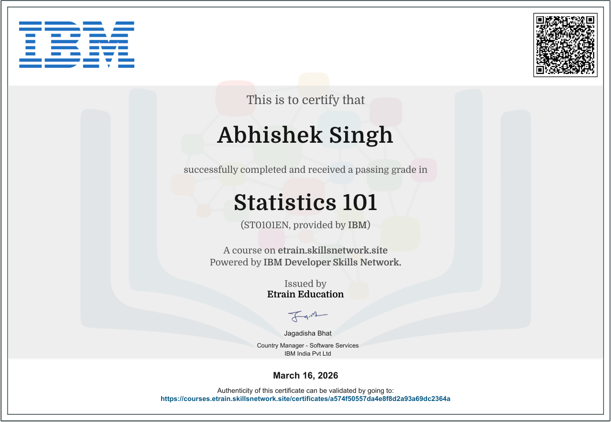

# Python Statistics MCQs

A comprehensive interactive question bank for the **GCF Python Statistics Certificate Course**. Practice with 360 multiple-choice questions covering all exam topics through 5 focused practice sets and 1 comprehensive final exam.

## 🎯 Features

- **360 Total MCQs** across 6 question sets
- **5 Practice Sets** (40 questions each) - focused topic coverage
- **1 Final Comprehensive Exam** (160 questions) - complete syllabus review
- **10 Core Topics** covered in every set:
  - 📐 NumPy & Statistics Module
  - 🐼 Pandas DataFrames & Analysis
  - 📊 Measures of Central Tendency
  - 📏 Measures of Dispersion
  - 〰️ Skewness & Kurtosis
  - 📈 Correlation & Regression
  - 🎲 Probability Rules & Concepts
  - 🔔 Probability Distributions
  - 🎯 Sampling & Central Limit Theorem
  - 🔬 Hypothesis Testing & Scales
- **Interactive Experience** with real-time scoring and explanations
- **Responsive Design** with dark industrial aesthetic
- **Difficulty Levels**: Easy, Medium, Hard, and Tricky questions

## 🏆 Certificate



This certificate represents successful completion of the **GCF Python Statistics Certificate Course**, demonstrating mastery of statistical computing with Python.

## 🚀 Getting Started

### Prerequisites
- Modern web browser (Chrome, Firefox, Safari, Edge)
- No installation required - runs entirely in browser

### Usage
1. Open `index.html` in your web browser
2. Browse the available question sets
3. Click on any set to start the quiz
4. Select answers and get instant feedback
5. View detailed explanations for each question
6. Check your final score and review performance

## 📁 Project Structure

```
Python-Statistics-MCQs/
├── index.html          # Main landing page with set selection
├── style.css           # Shared stylesheet (dark theme + neon accents)
├── Final.html          # Comprehensive final exam (160 questions)
├── set1.html           # Practice Set 1: Foundations & Core Stats
├── set2.html           # Practice Set 2: Deeper Concepts & Code
├── set3.html           # Practice Set 3: Advanced Analysis
├── set4.html           # Practice Set 4: Code-Heavy & Tricky
├── set5.html           # Practice Set 5: Final Boss — Full Review
└── README.md           # Project documentation
```

## 🛠️ Technologies Used

- **HTML5** - Structure and semantic markup
- **CSS3** - Styling with CSS Variables and Flexbox/Grid
- **Vanilla JavaScript** - Interactive quiz functionality
- **Google Fonts** - Clash Display, JetBrains Mono, DM Sans

## 📚 Question Distribution

| Topic | Practice Sets (each) | Final Exam | Total |
|-------|---------------------|------------|-------|
| NumPy & Stats Module | 4 | 16 | 36 |
| Pandas DataFrames | 4 | 16 | 36 |
| Central Tendency | 4 | 16 | 36 |
| Measures of Dispersion | 4 | 16 | 36 |
| Skewness & Kurtosis | 4 | 16 | 36 |
| Correlation & Regression | 4 | 16 | 36 |
| Probability | 4 | 16 | 36 |
| Probability Distributions | 4 | 16 | 36 |
| Sampling & CLT | 4 | 16 | 36 |
| Hypothesis Testing | 4 | 16 | 36 |

## 🎨 Design Features

- **Dark Industrial Theme** with neon blue accents
- **Uniform Card Layout** - all question sets display consistently
- **Responsive Grid** - adapts to different screen sizes
- **Interactive Elements** with hover effects and animations
- **Score Tracking** with progress bars and statistics
- **Result Screens** with performance analysis

## 📖 Learning Objectives

This question bank helps you master:
- Python statistical computing with NumPy and Pandas
- Statistical concepts and their practical applications
- Data analysis workflows and best practices
- Probability theory and distributions
- Hypothesis testing methodologies
- Real-world problem-solving with code examples

## 🤝 Contributing

Feel free to contribute by:
- Reporting bugs or issues
- Suggesting new questions
- Improving the user interface
- Adding more practice sets

## 📄 License

This project is created for educational purposes. Feel free to use and modify as needed for your learning journey.

---

**Happy Learning!** 📊🔬🎯
